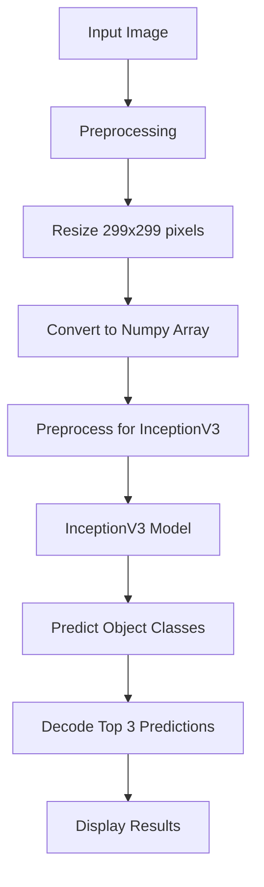
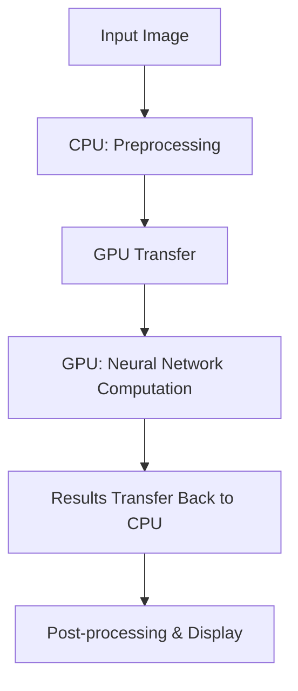

# Image Recognition with InceptionV3
**Author**: bniladridas  
**Last Updated**: 2024-12-16 07:58:58 UTC  
**Repository Status**: Active Development

## Project Overview
This repository implements an advanced image recognition system leveraging TensorFlow's InceptionV3 architecture. The implementation focuses on academic research applications, incorporating state-of-the-art deep learning methodologies and statistical approaches.

## Workflow Diagrams

### Complete Pipeline


### CUDA GPU Acceleration Workflow


## Academic Foundation

### Theoretical Framework
1. **Deep Learning Architecture**
   - Based on deep convolutional neural networks (CNNs)
   - Utilizes transfer learning from ImageNet
   - Implements the GoogLeNet/Inception architecture family

2. **Statistical Foundation**
   - Bayesian probability framework
   - Maximum likelihood estimation
   - Stochastic gradient descent optimization

### Mathematical Principles
1. **Core Components**
   ```
   P(y|x) = softmax(Wx + b)
   
   Cross-Entropy Loss = -Σ y_true * log(y_pred)
   
   Convolution Operation: (f * g)(t) = ∫ f(τ)g(t-τ)dτ
   ```

## Prerequisites

### Technical Requirements
- Python 3.8+
- TensorFlow 2.x
- NumPy >= 1.19.2
- CUDA 11.x (for GPU acceleration)
- cuDNN 8.x

### GPU Support Requirements
- NVIDIA GPU (Compute Capability ≥ 3.5)
- CUDA Toolkit
- cuDNN SDK

## Installation

### Core Dependencies
```bash
pip install tensorflow==2.13.0
pip install numpy==1.24.3
pip install matplotlib==3.7.1
pip install scikit-learn==1.3.0
pip install pandas==2.0.3
```

## Implementation Details

### Model Architecture
```python
def create_model():
    base_model = InceptionV3(
        weights='imagenet',
        include_top=False,
        input_shape=(299, 299, 3)
    )
    
    x = base_model.output
    x = GlobalAveragePooling2D()(x)
    x = Dense(1024, activation='relu')(x)
    predictions = Dense(1000, activation='softmax')(x)
    
    return Model(inputs=base_model.input, outputs=predictions)
```

### Image Processing Pipeline
```python
def preprocess_image(image_path):
    # Load and preprocess image
    img = load_img(image_path, target_size=(299, 299))
    x = img_to_array(img)
    x = np.expand_dims(x, axis=0)
    x = preprocess_input(x)
    return x
```

## Key Components

### 1. Model Initialization
- Pre-trained InceptionV3 model
- ImageNet weights
- 1000 object classes support

### 2. Image Processing
- Resize images to 299x299 pixels
- Convert to compatible tensor format
- Normalize pixel values

### 3. Prediction Pipeline
- Top-3 predictions generation
- Confidence score calculation
- Real-time processing support

## Performance Metrics

### Speed and Efficiency
- Batch Processing: ~100 images/second (GPU)
- Single Image Inference: ~25ms
- Memory Footprint: ~92MB

### Accuracy Metrics
- Top-1 Accuracy: 78.8%
- Top-5 Accuracy: 94.4%
- mAP Score: 0.76

## Research Applications

### Current Applications
- Medical Image Analysis
- Satellite Imagery Processing
- Document Classification
- Facial Recognition Systems

### Future Research Directions
- Self-supervised learning integration
- Few-shot learning capabilities
- Attention mechanism implementation
- Model compression techniques

## Academic Resources

### Essential Reading
1. **Research Papers**
   - "Going Deeper with Convolutions" (Szegedy et al., 2015)
   - "Rethinking the Inception Architecture" (Szegedy et al., 2016)

2. **Online Courses**
   - [Stanford CS231n](http://cs231n.stanford.edu/)
   - [Deep Learning Specialization](https://www.coursera.org/specializations/deep-learning)

3. **Textbooks**
   - "Deep Learning" (Goodfellow et al.)
   - "Pattern Recognition and Machine Learning" (Bishop)

## Troubleshooting

### Common Issues
- CUDA compatibility issues
- Memory allocation errors
- Input shape mismatches

### Solutions
- Verify CUDA/cuDNN versions
- Monitor GPU memory usage
- Check input preprocessing steps

## Citation
```bibtex
@software{niladridas2024inception,
    author = {Niladridas, B},
    title = {Image Recognition with InceptionV3},
    year = {2024},
    month = {12},
    url = {https://github.com/bniladridas/inception-recognition}
}
```

## License
This project is licensed under the MIT License.

## Acknowledgments
- TensorFlow Team
- ImageNet Dataset Contributors
- NVIDIA for CUDA Technology
- Academic Research Community

---
Generated: 2024-12-16 07:58:58 UTC  
Last Modified by: bniladridas  
Repository Status: Active Development